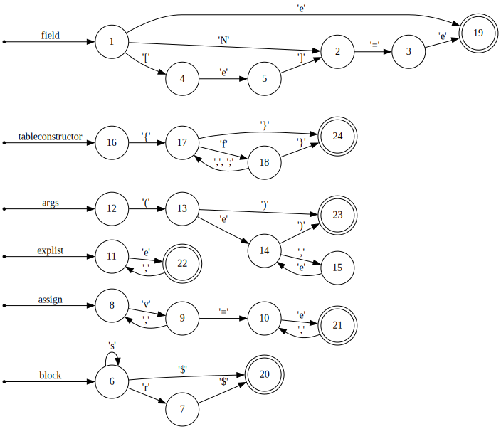

# 文法

## Lua 5.5のEBNF

- https://www.lua.org/manual/5.5/manual.html#9

```
chunk ::= block

block ::= {stat} [retstat]

stat ::= ';' |
    varlist '=' explist |
    functioncall |
    label |
    'break' |
    'goto' Name |
    'do' block 'end' |
    'while' exp 'do' block 'end' |
    'repeat' block 'until' exp |
    'if' exp 'then' block {'elseif' exp 'then' block} ['else' block] 'end' |
    'for' Name '=' exp ',' exp [',' exp] 'do' block 'end' |
    'for' namelist 'in' explist 'do' block 'end' |
    'function' funcname funcbody |
    'local' 'function' Name funcbody |
    'global' 'function' Name funcbody |
    'local' attnamelist ['=' explist] |
    'global' attnamelist |
    'global' [attrib] '*'

attnamelist ::= [attrib] Name [attrib] {',' Name [attrib]}

attrib ::= '<' Name '>'

retstat ::= 'return' [explist] [';']

label ::= '::' Name '::'

funcname ::= Name {'.' Name} [':' Name]

varlist ::= var {',' var}

var ::= Name | prefixexp '[' exp ']' | prefixexp '.' Name

namelist ::= Name {',' Name}

explist ::= exp {',' exp}

exp ::= 'nil' | 'false' | 'true' | Numeral | LiteralString | '...' | functiondef |
    prefixexp | tableconstructor | exp binop exp | unop exp

prefixexp ::= var | functioncall | '(' exp ')'

functioncall ::= prefixexp args | prefixexp ':' Name args

args ::= '(' [explist] ')' | tableconstructor | LiteralString

functiondef ::= 'function' funcbody

funcbody ::= '(' [parlist] ')' block 'end'

parlist ::= namelist [',' varargparam] | varargparam

varargparam ::= '...' [Name]

tableconstructor ::= '{' [fieldlist] '}'

fieldlist ::= field {fieldsep field} [fieldsep]

field ::= '[' exp ']' '=' exp | Name '=' exp | exp

fieldsep ::= ',' | ';'

binop ::= '+' | '-' | '*' | '/' | '//' | '^' | '%' |
    '&' | '~' | '|' | '>>' | '<<' | '..' |
    '<' | '<=' | '>' | '>=' | '==' | '~=' |
    'and' | 'or'

unop ::= '-' | 'not' | '#' | '~'
```

## Lua 5.5の演算子と優先順位

- https://www.lua.org/manual/5.5/manual.html#3.4.8

```
or
and
<     >     <=    >=    ~=    ==
|
~
&
<<    >>
..
+     -
*     /     //    %
unary operators (not   #     -     ~)
^
```

## prefixexp

- `prefixexp`は左再帰が循環して扱いにくいので演算子で整理する。
- `prefixexp`は`Name`か`'(' exp ')'`で開始する。
- どの演算子も左結合で同じ優先順位を持つ。
- 文が期待される場所に出現する`prefixexp`は`var`か`functioncall`である。
    - `var`ならば代入文である。
        - `var`の後に`'='`か`','`が続く。
    - `functioncall`ならば関数呼び出し文である。
    - `'(' exp ')'`は拒否される。

| 表現     | 文法                                     | 名称   |
|----------|------------------------------------------|--------|
| `a[b]`   | `prefixexp '[' exp ']'`                  | index  |
| `a.b`    | `prefixexp '.' Name`                     | member |
| `a(b)`   | `prefixexp '(' [explist] ')'`            | call   |
| `a{b}`   | `prefixexp '{' [fieldlist] '}'`          | call   |
| `a"b"`   | `prefixexp LiteralString`                | call   |
| `a:b(c)` | `prefixexp ':' Name '(' [explist] ')'`   | self   |
| `a:b{c}` | `prefixexp ':' Name '{' [fieldlist] '}'` | self   |
| `a:b"c"` | `prefixexp ':' Name LiteralString`       | self   |

## block

- `block`は`end`, `until`, `elseif`, `else`, `EOF`によって終端される。
- `{stat}`はこれに加えて`return`によっても終端される。

## 文法規則のDFA


